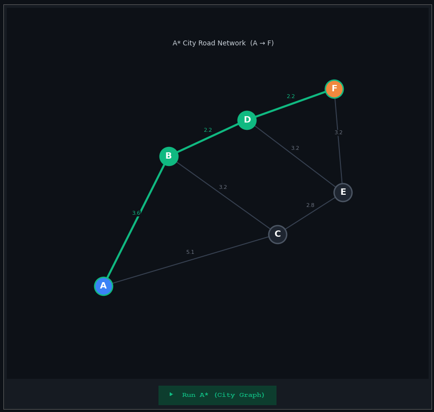
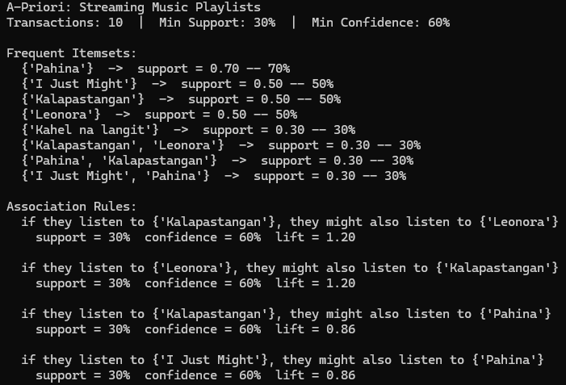
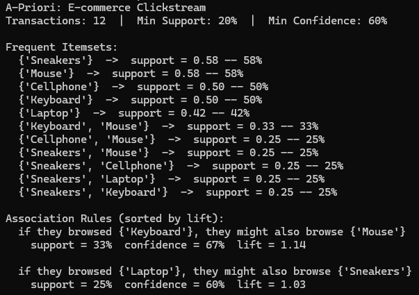

# Algorithm Demonstration using Python

## A* Search (A-Star)

**A\*** finds the shortest path between two nodes using `f(n) = g(n) + h(n)`, where g(n) is the cost so far and h(n) is a heuristic estimate to the goal.

### Example 1 — Grid Maze Pathfinding

A* navigates a 7×7 grid from **(S)** to **(G)** avoiding walls, using Manhattan distance as the heuristic.

### Example 2 — City Road Network

A* finds the cheapest route from city **A** to **F** across a weighted graph of 6 cities, using Euclidean distance as the heuristic.

---

## A-Priori

**A-Priori** discovers association rules — patterns that reveal which items tend to appear together across transactions.

### Example 1 — Streaming Music Playlists

Finds which OPM songs frequently appear together across 10 playlists, useful for powering song recommendations.

- **Min Support:** 30% — a song or pair must appear in at least 3 out of 10 playlists
- **Min Confidence:** 60% — the rule must be correct at least 60% of the time

### Example 2 — E-commerce Clickstream

Identifies which products are browsed together across 12 sessions, useful for what customers also viewed features.

- **Min Support:** 20% — a pair must appear in at least 2 out of 12 sessions
- **Min Confidence:** 60% — the rule must hold at least 60% of the time

