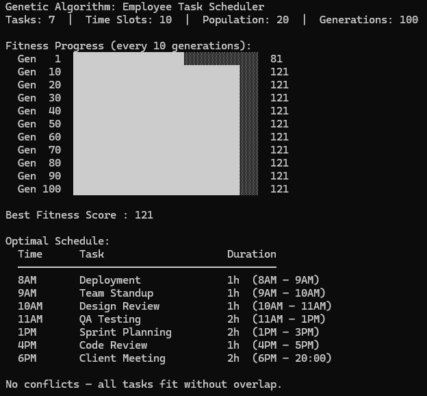
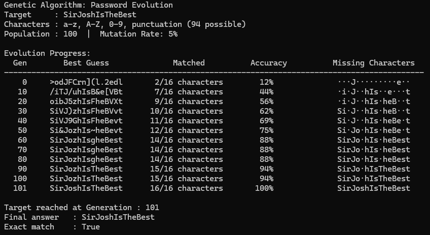

# Algorithm Demonstration using Python

## A* Search (A-Star)

**A\*** finds the shortest path between two nodes using `f(n) = g(n) + h(n)`, where g(n) is the cost so far and h(n) is a heuristic estimate to the goal.

### Example 1 — Grid Maze Pathfinding

A* navigates a 7×7 grid from **(S)** to **(G)** avoiding walls, using Manhattan distance as the heuristic.

---

### Example 2 — City Road Network

A* finds the cheapest route from city **A** to **F** across a weighted graph of 6 cities, using Euclidean distance as the heuristic.

---

## A-Priori

**A-Priori** discovers association rules — patterns that reveal which items tend to appear together across transactions.

### Example 1 — Streaming Music Playlists

Finds which songs frequently appear together across 10 playlists, useful for powering song recommendations.

- **Min Support:** 30% — a song or pair must appear in at least 3 out of 10 playlists
- **Min Confidence:** 60% — the rule must be correct at least 60% of the time

---

### Example 2 — E-commerce Clickstream

Identifies which products are browsed together across 12 sessions, useful for what customers also viewed features.

- **Min Support:** 20% — a pair must appear in at least 2 out of 12 sessions
- **Min Confidence:** 60% — the rule must hold at least 60% of the time

---

## Genetic Algorithm

The **Genetic Algorithm** is a search and optimization technique inspired by natural selection. It evolves a population of candidate solutions over multiple generations using **selection**, **crossover**, and **mutation** until the best solution is found.

### Example 1 — Employee Task Scheduler

Assigns 7 workplace tasks to available time slots across a workday (8AM–6PM) without conflicts, using fitness score to reward conflict-free and well-spread schedules.

- **Fitness** — starts at 100, deducts 20 per conflict, adds 3 per unique slot used
- **Population:** 20  |  **Generations:** 100  |  **Mutation Rate:** 20%

---

### Example 2 — Password Evolution

Evolves a population of random strings toward a target password, using character-by-character matching as the fitness score. The algorithm runs until an exact match is found.

- **Fitness** — counts how many characters match the target at the correct position (0–16)
- **Population:** 100  |  **Mutation Rate:** 5%

